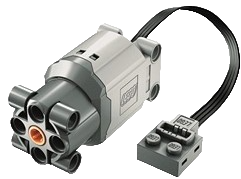
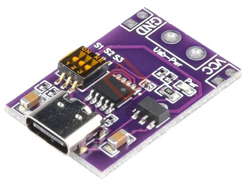
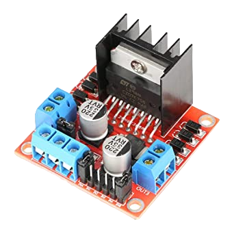
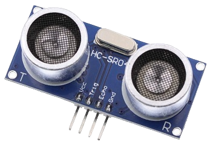
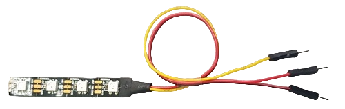
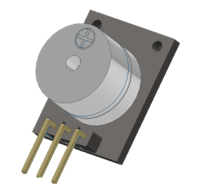
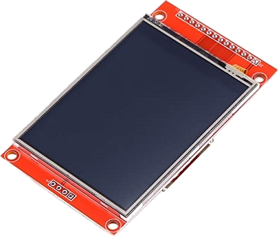
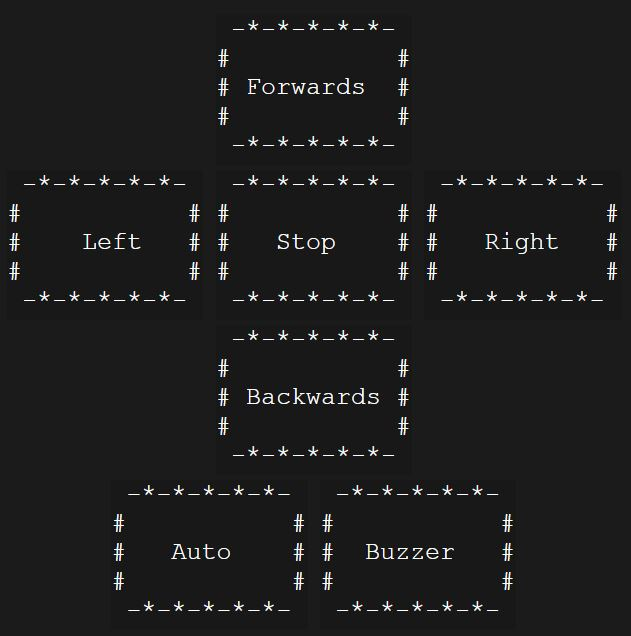

# Welcome to ESP-Robot written in Micropython
***
## Requirements specification:
- [Welcome to ESP-Robot written in Micropython](#welcome-to-esp-robot-written-in-micropython)
  - [Requirements specification:](#requirements-specification)
  - [1. Overview](#1-overview)
  - [2. Wiring](#2-wiring)
  - [3. Lego Chassis](#3-lego-chassis)
  - [4. Lego DC Motors](#4-lego-dc-motors)
  - [5. Main Hardware](#5-main-hardware)
  - [6. Sensors](#6-sensors)
  - [7. Light](#7-light)
  - [8. Sound](#8-sound)
  - [9. Display](#9-display)
  - [10. the PROGRAMM](#10-the-programm)
  - [11. ESP Robot Self-Driving Logic](#11-esp-robot-self-driving-logic)
  - [12. To-Do's and planning for the next Version:](#12-to-dos-and-planning-for-the-next-version)
***
  
## 1. Overview
The ESP Lego Robot is a low budget project. You will need:
- some Legos (or another chassis)
- Power Bank with PD (Power Delivery Out 9V for the motors)
- 2x ower Function L Motors - both arround 50$ or buy some other brick motors 10$ (or another chassis)
- L298 N Motor Driver-  2,50 $
- ESP32 S3 - arround 20 $
- HC-SR04 Sensor - 3 $
- optional Buzzer and Neopixel LEDs - arround 4 $
- optional Display ili9341 15 $  
**basic components together arround 35,50 $**  
**All together with Buzzer, Neopixel and Display arround 55 $**  

This the mp-remote commands for the ESP32 S3 board:  
- this command upload the main.py to the micropython board over com11  
`python.exe -m mpremote connect com11 cp main.py :`  
- this command connects to the python prompt over com11  
`python.exe -m mpremote connect com11`  

***
 

## 2. Wiring
this is the wiring:

I have also uploaded the frtzing file. The controller is unfortunately a similar ESP32-S2/S3 dev kit. Power Delivery I also have another one built into the plan. I hope the Wiring Plan helps you anyway.
***
 

## 3. Lego Chassis
Yes, there are a lot of chassis on the market, if you look closer, they are only made of sheet metal or fall apart just by looking at them. A modular base is needed - Lego! There is a super tool for Lego, the Studio 2.0. If you have another platform or another chassis, you can build your own robot creation.
The Robot is designed with Studio 2.0, here is the download link:
[Bricklink Studio 2.0](https://www.bricklink.com/v3/studio/download.page)  
You can read the whole story of the lego chassis here: [Lego Chassis](https://github.com/FabseRobotics/esp-robot/tree/main/Chassis)  


***
 

## 4. Lego DC Motors
For the Lego chassis I choose two DC Power Function L motors. These motors have a four wire connection. I use the 2 wires in the middle, these control the DC motor clockwise / anticlockwise rotation:
Here is the link:
[Lego Power Functions L](https://www.bricklink.com/v2/catalog/catalogitem.page?S=88003-1)  
**Lego Power Function L :**  
  

***
 

## 5. Main Hardware
this is the main hardware from the ESP Robot:
- Microcontroller ESP32 S3
- Motor Controller L298N
- PD-Delivery Board, with 9V for the L298N

ESP32 S3, here i choose ESP32-Leaf-S3 from Banana Pi. I flashed the newest Micropython 1.19 on it. The GPIOs Numbers are direct on the Board.
For more informations visit the website:
[ESP32-Leaf-S3](https://wiki.banana-pi.org/BPI-Leaf-S3)  
**ESP32-Leaf-S3 :**  
  

Power delivery circuit, USB-C with 3 DIP-Switches, it's for setting the DC power. The Power Function L Motors need 9 Volt, so i take the 9 Volt setting. [here is the link](https://de.aliexpress.com/item/1005004874144607.html)  
**PD-Delivery Board USB-C :**  
  

This motor controller can controll 2 DC Motors. Pefect for this project. 9 Volt entry power, with a integrated voltage transformer to 5 Volt. We need 6 signal pins from the ESP32 to it. E1, L1, L2, L3, L4, E2  
**L298N Controller :**  
  

***
 

## 6. Sensors
This is the only sensor of the ESP32 Robot. In the future i will add some more to it. By emitting a clicking sound in the ultrasonic range and measuring the delay of the resulting echo, this ultrasonic sensor enables you to determine the distance to an object.  
**HC-SR04 - Ultrasonic Sensor :**   
  
***
 

## 7. Light
The Robot defentily need some lights. "A robot needs a light to help it see in the dark, just like how humans need a flashlight!"
So the Robot get some wb2812b LEDs, easy to use and found much in the network. The ESP Robot have a 3 LEDs Strip wb2812b. It's nice to have an adressable LED or high power LED or small Lasers. When they have 5V, it's easy to use them with a microcontroller.  
**Neopixel WB2812b :**  
  
***
 

## 8. Sound
Beeeep, Bep, Sound. It's very easy to you a piezo buzzer for make some R2D2 noises.
Some small piezo buzzer are avaiable in all electronic onlinestores.
THe R2D2 Sound from main.py is mixxed with the Neopixel LEDs, there are in the same coding loop, and then the light looks soundactiv. Look in the main.py for more information about this, i comment a few lines in there.  
**Piezo Buzzer :**  
  
***  
 

## 9. Display
So the Robot needs a Display, i chosse the ili9341 Touchscreen Display. The touch i not use yet, only the display for show some informations. In this Version 1 the Display shows the Wifi Network IP and the currently Status. The micropython library comes from this github repository [rdagger](https://github.com/rdagger/micropython-ili9341)  
**ili9341 Display :**  

***
 

## 10. the PROGRAMM
Is the heart of the Robot, without, it's can do nothing!
For some months i learned Python, and so i programmed it in Micropython.
I'm not explain here the micropython programm, because i write in the code many comments...  
This is the webserver with the touch buttons:
  
***
 

## 11. ESP Robot Self-Driving Logic
What does the ESP Robot do? 
- Forward, >35cm Distance measuring, Stop, Backward, Left or Right, Forward again  
  
  

***  
 

## 12. To-Do's and planning for the next Version:
- [ ] jetson nano / pi
- [ ] new models of the Lego Chassis, there is no end
- [ ] Programming it better, there is no end
- [ ] add some sensors e.g. ESP-Cam, Cam, one more HC-SR04
- [ ] 360° Lidar Sensor with mapping
- [ ] new self-driving logic's and algorithms
- [ ] Visualization and Photos
- [ ] SLAM (Mapping) with 360° Lidar Sensors
- [ ] braitenberg-vehikel -> https://de.wikipedia.org/wiki/Braitenberg-Vehikel  
***
